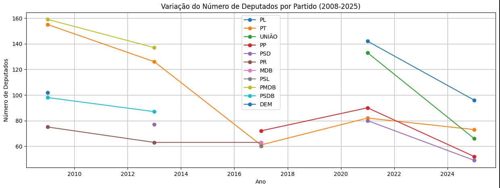

# 📊 Análise da Evolução dos Partidos na Câmara dos Deputados 🇧🇷  

Este projeto utiliza **Ciência de Dados e Python** para analisar a **evolução histórica da composição partidária** na **Câmara dos Deputados do Brasil**. A partir dos **Dados Abertos da Câmara**, criamos uma **série temporal** mostrando como os partidos políticos ganharam ou perderam cadeiras entre **2008 e 2025**.  

---

## 🚀 **Recursos do Projeto**
✅ Coleta de dados diretamente da **API de Dados Abertos da Câmara**  
✅ Construção de um **banco de dados histórico dos deputados por partido**  
✅ **Visualização interativa** da evolução dos partidos ao longo dos anos  
✅ Análise da **variação percentual do número de cadeiras**  
✅ Gráficos e relatórios gerados com **Pandas e Matplotlib**  

---


---

## 📊 **Exemplo de Visualização**
  

O gráfico acima mostra a **distribuição de cadeiras** na Câmara por partido ao longo dos anos, destacando tendências de crescimento ou declínio.

---

## 🛠️ **Como Executar o Projeto**
### 1️⃣ Clone o Repositório  
```bash
$ git clone git@github.com:wdvictor/open-data-camara-deputados-analytics.git
$ cd projeto-análise-partidos
```